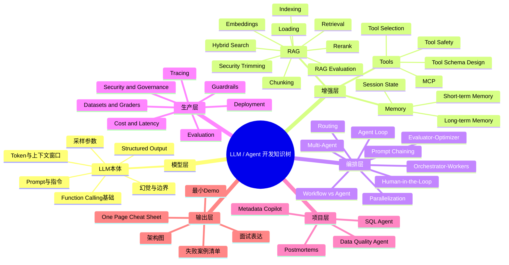

# Grant 的 LLM / Agent 开发知识树（含总思维导图 + 节点填空模板）

> 用法说明：
> - 这份文档分成 **总览 → 知识树 → 每个节点该写什么 → 通用填空模板 → 每周复习建议**。
> - 你以后每学一个主题，都把内容填回对应节点；不要散着记。
> - 目标不是“收集资料”，而是形成一套 **可解释、可复盘、可面试表达** 的知识系统。

---

# 0. 总览：这套知识树怎么用

## 0.1 你要解决的核心问题

如果你已经学过一遍 LLM / Agent，但觉得知识碎、串不起来，通常不是因为内容记不住，而是因为缺少一个统一的系统框架。你要做的不是继续“叠加新知识”，而是把旧知识统一挂到同一棵树上。

这棵树采用 **4 层结构**：

1. **模型层（Model Layer）**：LLM 本身是什么、会什么、不会什么
2. **增强层（Augmentation Layer）**：如何给模型补知识、补行动、补状态
3. **编排层（Orchestration Layer）**：多步任务如何组织为 workflow / agent
4. **生产层（Production Layer）**：如何让系统可评测、可观测、可控、可上线

---

## 0.2 整体方法论

以后你复习任何一个知识点，都做三件事：

- **归类**：先判断它属于哪一层
- **重建**：先不用看资料，靠自己写一遍 / 画一遍
- **产出**：给这个节点留下“定义 + 边界 + 流程 + 失败案例 + 最小 demo”

---

# 1. 总思维导图（Markdown 版）

> 如果你的 Markdown 编辑器支持 Mermaid，可以直接渲染下面这张图。



---

# 2. 总知识树目录（建议直接照着建笔记库）

```text
LLM-Application-Agent-Knowledge-Base/
├── 00_Overview
│   ├── Total_Map.md
│   ├── Terminology.md
│   └── Decision_Framework.md
│
├── 01_Model_Layer
│   ├── Tokens_Context_Window.md
│   ├── Prompting.md
│   ├── Structured_Output.md
│   ├── Function_Calling_Basics.md
│   └── Hallucination_Boundaries.md
│
├── 02_Augmentation_Layer
│   ├── RAG/
│   │   ├── Loading.md
│   │   ├── Chunking.md
│   │   ├── Embeddings.md
│   │   ├── Indexing.md
│   │   ├── Retrieval.md
│   │   ├── Rerank.md
│   │   ├── Hybrid_Search.md
│   │   ├── Security_Trimming.md
│   │   └── Evaluation.md
│   │
│   ├── Tools/
│   │   ├── Tool_Schema_Design.md
│   │   ├── Tool_Selection.md
│   │   ├── Tool_Safety.md
│   │   └── MCP.md
│   │
│   └── Memory/
│       ├── Short_Term_Memory.md
│       ├── Long_Term_Memory.md
│       └── Session_State.md
│
├── 03_Orchestration_Layer
│   ├── Workflow_vs_Agent.md
│   ├── Prompt_Chaining.md
│   ├── Routing.md
│   ├── Parallelization.md
│   ├── Orchestrator_Workers.md
│   ├── Evaluator_Optimizer.md
│   ├── Agent_Loop.md
│   ├── Multi_Agent.md
│   └── Human_in_the_Loop.md
│
├── 04_Production_Layer
│   ├── Tracing.md
│   ├── Evaluation.md
│   ├── Datasets_and_Graders.md
│   ├── Guardrails.md
│   ├── Security_and_Governance.md
│   ├── Cost_and_Latency.md
│   └── Deployment.md
│
├── 05_Projects
│   ├── Metadata_Copilot.md
│   ├── SQL_Agent.md
│   ├── Data_Quality_Agent.md
│   └── Postmortems.md
│
└── 06_CheatSheets
    ├── One_Page_RAG.md
    ├── One_Page_Agent.md
    ├── One_Page_Tool_Calling.md
    └── Interview_QA.md
```

---

# 3. 每个层级应该写什么内容（节点填空版）

> 下面不是“知识点解释”，而是 **你在每个节点里到底该写什么**。你以后打开任何一个节点，就按这些问题往下填。

---

## 3.1 模型层（01_Model_Layer）

### 3.1.1 `Tokens_Context_Window.md`

```markdown
# Tokens & Context Window

## 1. 它是什么？
- 用一句话解释 token 是什么：
- 用一句话解释 context window 是什么：

## 2. 为什么它重要？
- 对提示词的影响：
- 对工具定义的影响：
- 对多轮对话的影响：
- 对 RAG 的影响：

## 3. 常见误区
- 我以前误以为：
- 现在我知道：

## 4. 和相邻概念的区别
- token vs 字符 / 单词：
- context window vs memory：
- context window vs RAG：

## 5. 实战判断题
- 如果上下文满了，通常有哪些处理方法？
- 哪些信息不应该持续塞进上下文？

## 6. 失败案例
- 一个因为上下文过长导致效果变差的例子：
- 原因分析：
- 修复方法：

## 7. 最小 demo
- 我会做一个什么小实验来验证这个概念？
```

---

### 3.1.2 `Prompting.md`

```markdown
# Prompting

## 1. 它是什么？
- Prompt 的定义：
- System / Developer / User prompt 的区别：

## 2. 它解决什么问题？
- 主要解决的是“行为引导”还是“知识补充”？
- Prompt 能做什么：
- Prompt 不能做什么：

## 3. 常见模式
- 角色设定：
- 输出格式要求：
- Few-shot：
- 约束条件：
- 反例约束：

## 4. 我自己的经验总结
- 什么场景更依赖 prompt 设计：
- 什么场景 prompt 再调也救不了：

## 5. 常见失败模式
- 指令冲突：
- 过度冗长：
- 模糊约束：
- 不可验证要求：

## 6. 一个优化案例
- 原始 prompt：
- 问题：
- 改进后 prompt：
- 效果对比：
```

---

### 3.1.3 `Structured_Output.md`

```markdown
# Structured Output

## 1. 它是什么？
- 什么叫 structured output：
- 为什么“让模型输出 JSON”不等于结构化输出：

## 2. 它解决什么问题？
- 解析稳定性：
- 下游系统可消费性：
- 校验性：

## 3. 和普通自然语言输出的区别
- 适用场景：
- 优势：
- 代价：

## 4. 设计一个 schema 时我会考虑什么？
- 字段：
- 必填项：
- 枚举值：
- optional 的定义方式：
- 错误处理：

## 5. 失败案例
- 因为 schema 不清晰导致解析失败的案例：
- 修复方式：

## 6. 最小 demo
- 我会让模型返回什么结构？
- 用什么方式校验？
```

---

### 3.1.4 `Function_Calling_Basics.md`

```markdown
# Function Calling Basics

## 1. 它是什么？
- 一句话定义 function/tool calling：
- 模型负责什么：
- 应用负责什么：

## 2. 基本流程
- 第一步：
- 第二步：
- 第三步：
- 第四步：
- 第五步：

## 3. 关键组件
- tool schema 包含哪些字段：
- strict mode 是什么：
- parallel tool calls 是什么：

## 4. 与相邻概念的区别
- tool calling vs 普通问答：
- tool calling vs agent：

## 5. 常见失败模式
- 选错工具：
- 参数错：
- 结果没回填：
- 工具过多导致混淆：

## 6. 一个最小例子
- 我定义一个什么工具：
- 参数 schema：
- 后端执行逻辑：
```

---

### 3.1.5 `Hallucination_Boundaries.md`

```markdown
# Hallucination & Boundaries

## 1. 它是什么？
- 我如何定义 hallucination：
- 什么不一定算 hallucination：

## 2. 为什么会发生？
- 缺知识：
- 缺约束：
- 缺检索：
- 缺验证：

## 3. 如何减少？
- 用 RAG：
- 用工具：
- 用结构化输出：
- 用评测：

## 4. 不要误解的地方
- “模型答得像真的” ≠ 真：
- “有上下文” ≠ 一定忠实：

## 5. 一个实际案例
- 问题：
- 幻觉表现：
- 我怎么发现：
- 我怎么修：
```

---

## 3.2 增强层（02_Augmentation_Layer）

### A. RAG 子目录

---

### 3.2.1 `RAG/Loading.md`

```markdown
# RAG - Loading

## 1. 这个环节是什么？
- Loading 的定义：
- 它在整个 RAG 流程中的位置：

## 2. 我的数据源有哪些？
- 文档：
- PDF：
- 网页：
- 数据库：
- API：
- 其他：

## 3. 进入系统前要做什么预处理？
- 去噪：
- 格式统一：
- 元数据抽取：
- 权限信息保留：

## 4. 这个环节最容易出什么问题？
- 文档结构丢失：
- 元数据丢失：
- 权限信息没带上：
- 增量更新机制缺失：

## 5. 我的实践方案
- 数据接入方式：
- 更新频率：
- 数据质量检查：
```

---

### 3.2.2 `RAG/Chunking.md`

```markdown
# RAG - Chunking

## 1. 为什么要切块？
- 不切块会怎样：
- 切块的核心目标：

## 2. 我的切块策略候选
- 固定长度：
- 滑窗重叠：
- 按标题层级：
- 按段落：
- 按语义：

## 3. 策略选择标准
- 文档类型：
- 检索任务类型：
- 回答粒度：
- 成本与效果：

## 4. 常见失败模式
- 块过大：
- 块过小：
- 结构被切断：
- 表格 / 代码 / 配置项切坏：

## 5. 复盘模板
- 当前 chunk size：
- overlap：
- 问题现象：
- 怀疑原因：
- 调整方案：
```

---

### 3.2.3 `RAG/Embeddings.md`

```markdown
# RAG - Embeddings

## 1. Embedding 是什么？
- 一句话解释：
- 它为什么能用于语义检索：

## 2. 它解决什么问题？
- 关键词匹配的局限：
- 语义相似的优势：

## 3. 需要关注的选择项
- 模型选择：
- 维度：
- 成本：
- 多语言支持：

## 4. 常见误区
- embedding 好 ≠ 检索一定好：
- 向量库 ≠ 完整 RAG：

## 5. 失败案例
- 召回了一堆“语义像但不相关”的内容：
- 可能原因：
- 如何修复：
```

---

### 3.2.4 `RAG/Indexing.md`

```markdown
# RAG - Indexing

## 1. Indexing 是什么？
- 索引在 RAG 里的作用：
- 只是“存向量”吗？

## 2. 我会存哪些信息？
- 原文 chunk：
- embedding：
- metadata：
- 权限标签：
- 文档来源：
- 更新时间：

## 3. 索引设计关注点
- 可过滤性：
- 可回溯性：
- 增量更新：
- 删除同步：

## 4. 常见失败模式
- 只存向量不存足够 metadata：
- 无法做权限过滤：
- 文档更新但索引没刷新：
```

---

### 3.2.5 `RAG/Retrieval.md`

```markdown
# RAG - Retrieval

## 1. Retrieval 是什么？
- 一句话定义：
- 它和生成的关系：

## 2. 我现在有哪些检索策略？
- 纯向量检索：
- 关键词检索：
- Hybrid：
- 多路 retriever：
- Router retriever：

## 3. 检索效果看什么？
- 召回率：
- 相关性：
- 权限正确性：
- 延迟：

## 4. 常见失败模式
- top-k 太小：
- top-k 太大：
- query 改写不合理：
- retriever 与文档特征不匹配：

## 5. 一个调优案例
- 查询：
- 原始效果：
- 调整点：
- 新效果：
```

---

### 3.2.6 `RAG/Rerank.md`

```markdown
# RAG - Rerank

## 1. 为什么需要 rerank？
- 检索之后为什么还不够：
- rerank 的目标：

## 2. 我有哪些重排方式？
- 基于模型：
- 基于规则：
- 基于元数据：

## 3. 适用场景
- 语义相似但业务不相关：
- 术语精确匹配优先：
- 多来源合并结果：

## 4. 成本与收益权衡
- 多一层 rerank 的代价：
- 什么情况下值得加：
```

---

### 3.2.7 `RAG/Hybrid_Search.md`

```markdown
# RAG - Hybrid Search

## 1. 什么是 hybrid search？
- 一句话定义：
- 为什么企业场景常用它：

## 2. 什么时候纯向量不够？
- 术语精确匹配：
- 编号 / ID / 策略名：
- 特定字段过滤：

## 3. 我的 hybrid 设计
- 关键词查询策略：
- 向量查询策略：
- 合并权重：
- rerank：

## 4. 一个对比例子
- query：
- 纯向量结果：
- hybrid 结果：
- 为什么 hybrid 更好：
```

---

### 3.2.8 `RAG/Security_Trimming.md`

```markdown
# RAG - Security Trimming

## 1. 为什么 RAG 要考虑权限？
- 用户是否有权看到该内容：
- 文档级 / chunk 级权限：

## 2. 我的权限模型
- 来源系统权限继承：
- 元数据过滤：
- 角色权限：
- 数据域隔离：

## 3. 风险点
- 索引中丢失权限标签：
- 检索正确但权限错误：
- cache 泄露：

## 4. 一个越权案例复盘
- 现象：
- 根因：
- 修复：
```

---

### 3.2.9 `RAG/Evaluation.md`

```markdown
# RAG - Evaluation

## 1. 我要评估 RAG 的什么？
- 检索对不对：
- 回答对不对：
- 回答是否忠实于来源：
- 成本和延迟：

## 2. 评测维度
- context precision：
- context recall：
- answer correctness：
- faithfulness：

## 3. 我的最小评测集
- 样本数量：
- 数据来源：
- 题型分布：
- 评分标准：

## 4. 一个评测记录模板
- 日期：
- 版本：
- chunk 策略：
- retriever：
- rerank：
- 模型：
- 结果：
```

---

### B. Tools 子目录

---

### 3.2.10 `Tools/Tool_Schema_Design.md`

```markdown
# Tool Schema Design

## 1. 这个工具解决什么问题？
- 工具名称：
- 职责边界：
- 为什么要做成工具而不是 prompt：

## 2. schema 设计
- name：
- description：
- parameters：
- required：
- enum：
- additionalProperties：
- strict：

## 3. 工具使用说明（给模型看的）
- 什么时候该调用：
- 什么情况下不要调用：
- 输入格式要求：
- 输出含义：
- 示例：

## 4. 常见失败方式
- 模型传错参数：
- description 太模糊：
- 工具边界与别的工具重叠：

## 5. 一次优化记录
- 原始 schema：
- 问题：
- 调整后 schema：
- 效果：
```

---

### 3.2.11 `Tools/Tool_Selection.md`

```markdown
# Tool Selection

## 1. 为什么模型会选错工具？
- 描述不清：
- 工具过多：
- 功能重叠：
- 输入语义模糊：

## 2. 我如何提高工具选择准确率？
- 合并相似工具：
- namespace：
- allowed_tools：
- 更清晰的说明：
- 减少初始暴露数量：

## 3. 一个失败案例
- 用户输入：
- 错误选择：
- 根因：
- 修复：
```

---

### 3.2.12 `Tools/Tool_Safety.md`

```markdown
# Tool Safety

## 1. 为什么工具调用有风险？
- 写操作风险：
- 越权风险：
- 成本风险：
- 外部系统副作用：

## 2. 风险分级
- 只读工具：
- 低风险写工具：
- 高风险执行工具：

## 3. 我的安全措施
- 参数校验：
- 权限检查：
- 审批：
- 审计日志：
- 幂等处理：

## 4. 工具安全复盘模板
- 工具名：
- 风险级别：
- 失败场景：
- 防护措施：
```

---

### 3.2.13 `Tools/MCP.md`

```markdown
# MCP

## 1. MCP 是什么？
- 一句话定义：
- 它解决什么问题：

## 2. MCP 的核心对象
- Resources：
- Prompts：
- Tools：
- Host / Client / Server：

## 3. 为什么它重要？
- 标准化集成：
- 统一工具接入：
- 生态互操作：

## 4. 安全注意点
- 用户同意：
- 数据访问控制：
- 工具调用审批：

## 5. 我现在怎么理解它和普通 function calling 的关系？
- 相同点：
- 不同点：
```

---

### C. Memory 子目录

---

### 3.2.14 `Memory/Short_Term_Memory.md`

```markdown
# Short-term Memory

## 1. 什么是短期记忆？
- 当前会话历史：
- 当前任务运行状态：

## 2. 它解决什么问题？
- 多轮上下文：
- 当前任务连续性：

## 3. 常见实现
- message history：
- thread_id：
- checkpointer：

## 4. 风险点
- 过长导致上下文爆掉：
- 无清理策略：
- 误记住不该保留的信息：
```

---

### 3.2.15 `Memory/Long_Term_Memory.md`

```markdown
# Long-term Memory

## 1. 什么是长期记忆？
- 跨会话保留的信息：
- 用户偏好 / 历史行为 / 常用约束：

## 2. 什么应该进长期记忆？
- 适合保存的：
- 不适合保存的：

## 3. 风险与治理
- 过度记忆：
- 隐私问题：
- 记错：

## 4. 一个设计案例
- 对象：
- 存储方式：
- 使用方式：
```

---

### 3.2.16 `Memory/Session_State.md`

```markdown
# Session State

## 1. Session State 和 memory 的关系
- 相同点：
- 不同点：

## 2. 我要维护哪些状态？
- 当前任务阶段：
- 已用工具：
- 已确认参数：
- 预算 / 重试次数：

## 3. 一个状态设计模板
- state 字段：
- 字段含义：
- 生命周期：
```

---

## 3.3 编排层（03_Orchestration_Layer）

### 3.3.1 `Workflow_vs_Agent.md`

```markdown
# Workflow vs Agent

## 1. Workflow 是什么？
- 一句话定义：
- 控制权在谁手里：
- 适合什么问题：

## 2. Agent 是什么？
- 一句话定义：
- 控制权在谁手里：
- 适合什么问题：

## 3. 两者核心区别
- 路径是否预定义：
- 步骤是否可预测：
- 可控性：
- 成本：
- 调试难度：

## 4. 判断题模板
- 这个需求是否步骤固定？
- 是否需要模型动态决定下一个动作？
- 是否能用简单流程硬编码？

## 5. 结论模板
- 我认为这个需求更适合：
- 原因：
```

---

### 3.3.2 `Prompt_Chaining.md`

```markdown
# Prompt Chaining

## 1. 它是什么？
- 用一句话定义 prompt chaining：

## 2. 什么时候适合用？
- 任务能否被拆成固定步骤：
- 每一步是否能更容易判断对错：

## 3. 一个例子
- Step 1：
- Step 2：
- Step 3：

## 4. 常见风险
- 步骤过多导致延迟高：
- 前一步错误传染到后一步：
- 中间结果不可验证：
```

---

### 3.3.3 `Routing.md`

```markdown
# Routing

## 1. 它是什么？
- 一句话定义：

## 2. 路由维度有哪些？
- 按任务类型：
- 按难度：
- 按用户群体：
- 按数据源：

## 3. 实战设计
- 分类器如何做：
- 下游分支有哪些：
- 路由错了怎么办：

## 4. 一个案例
- 输入类型：
- 路由结果：
- 为什么这么设计：
```

---

### 3.3.4 `Parallelization.md`

```markdown
# Parallelization

## 1. 它是什么？
- sectioning：
- voting：

## 2. 什么时候适合并行？
- 子任务互相独立：
- 需要多个视角：
- 需要投票提高鲁棒性：

## 3. 注意事项
- 并发成本：
- 合并策略：
- 超时控制：
```

---

### 3.3.5 `Orchestrator_Workers.md`

```markdown
# Orchestrator-Workers

## 1. 它是什么？
- orchestrator 的职责：
- worker 的职责：

## 2. 适用场景
- 子任务数量事先不可知：
- 输入复杂度高：
- 多源信息整合：

## 3. 设计模板
- orchestrator 输入：
- worker 类型：
- worker 输出：
- 汇总策略：

## 4. 风险点
- 过度拆分：
- worker 重复劳动：
- 汇总不一致：
```

---

### 3.3.6 `Evaluator_Optimizer.md`

```markdown
# Evaluator-Optimizer

## 1. 它是什么？
- generator 干什么：
- evaluator 干什么：

## 2. 什么时候值得加这个循环？
- 评价标准是否清晰：
- 质量是否比时延更重要：

## 3. 一个模板
- 初稿生成要求：
- 评审维度：
- 迭代次数上限：
```

---

### 3.3.7 `Agent_Loop.md`

```markdown
# Agent Loop

## 1. Agent Loop 的最小结构
- goal：
- plan：
- act：
- observe：
- decide next：
- stop：

## 2. 我的 agent 当前能做什么？
- 会规划吗：
- 会调工具吗：
- 会利用结果修正吗：
- 会停止吗：

## 3. 停止条件设计
- 最大步数：
- 成功条件：
- 失败退出：
- 人工接管：

## 4. 一个最小 agent 例子
- 任务：
- 可用工具：
- 运行轨迹：
```

---

### 3.3.8 `Multi_Agent.md`

```markdown
# Multi-Agent

## 1. 为什么不用单 agent？
- 原因：
- 任务复杂度：
- 上下文隔离：

## 2. 我的 agent 角色设计
- Planner：
- Researcher：
- Executor：
- Reviewer：

## 3. 协作方式
- 顺序协作：
- 并行协作：
- handoff：

## 4. 风险点
- 角色边界模糊：
- 上下文重复：
- 协调成本高：
```

---

### 3.3.9 `Human_in_the_Loop.md`

```markdown
# Human in the Loop

## 1. 为什么要引入人？
- 高风险动作：
- 不确定性高：
- 法规 / 合规要求：

## 2. 哪些节点要加人工确认？
- 写操作：
- 发送外部通知：
- 删除 / 覆盖：
- 高金额 / 高影响操作：

## 3. 设计模板
- 触发条件：
- 需要展示给人的信息：
- 人的选择项：
- 之后系统怎么继续：
```

---

## 3.4 生产层（04_Production_Layer）

### 3.4.1 `Tracing.md`

```markdown
# Tracing

## 1. 为什么需要 tracing？
- 没有 tracing 时我会遇到什么问题：
- tracing 能回答哪些问题：

## 2. 我要记录哪些 span / 事件？
- prompt：
- retrieval：
- rerank：
- tool call：
- tool output：
- final answer：
- 错误：
- latency：
- token：

## 3. 一个 trace 复盘模板
- 用户问题：
- 调了哪些工具：
- 检索了什么：
- 哪一步出错：
- 下一步怎么改：
```

---

### 3.4.2 `Evaluation.md`

```markdown
# Evaluation

## 1. 评测系统要回答什么问题？
- 这个系统比上一个版本更好吗？
- 错是错在 prompt / retrieval / tool / route 哪一层？

## 2. 评测对象
- 单轮回答：
- agent 轨迹：
- tool selection：
- RAG 结果：

## 3. 评测方法
- 人工评分：
- 规则评分：
- LLM-as-a-judge：
- trace grading：

## 4. 一个评测模板
- 用例 ID：
- 输入：
- 预期行为：
- 实际行为：
- 评分：
- 备注：
```

---

### 3.4.3 `Datasets_and_Graders.md`

```markdown
# Datasets and Graders

## 1. 我的评测数据集来自哪里？
- 真实用户问题：
- 故障 case：
- 业务规则边界：

## 2. 数据集设计维度
- 简单问题：
- 长尾问题：
- 高风险问题：
- 多工具问题：
- 多跳问题：

## 3. grader 设计
- 正确性 grader：
- 工具调用 grader：
- 路由 grader：
- 格式 grader：

## 4. 版本控制
- 数据集版本：
- grader 版本：
- 模型版本：
```

---

### 3.4.4 `Guardrails.md`

```markdown
# Guardrails

## 1. Guardrail 是什么？
- 输入防护：
- 输出防护：
- Tool 调用防护：

## 2. 我的 guardrails 列表
- PII 检测：
- 禁止词 / 敏感域：
- 输出格式约束：
- 工具白名单：

## 3. 一条 guardrail 的定义模板
- 名称：
- 触发条件：
- 阻断 / 警告 / 交由人工：
- 记录方式：
```

---

### 3.4.5 `Security_and_Governance.md`

```markdown
# Security and Governance

## 1. 这个系统存在哪些安全面？
- 数据访问：
- 结果展示：
- 工具执行：
- 日志留存：

## 2. 我的治理清单
- 权限模型：
- 审计日志：
- 隐私处理：
- 敏感信息脱敏：
- 越权防护：

## 3. 风险复盘模板
- 风险类型：
- 触发路径：
- 后果：
- 缓解措施：
```

---

### 3.4.6 `Cost_and_Latency.md`

```markdown
# Cost and Latency

## 1. 成本来自哪里？
- token：
- 多模型调用：
- 多轮 agent：
- rerank / 工具 / 检索：

## 2. 延迟来自哪里？
- 检索：
- 模型推理：
- 工具 I/O：
- 多步编排：

## 3. 我的优化策略
- 减少步骤：
- 限制工具数量：
- 并行化：
- 缓存：
- 更合理的模型路由：

## 4. 一条复盘记录
- 当前场景：
- 成本：
- 延迟：
- 关键瓶颈：
- 优化动作：
```

---

### 3.4.7 `Deployment.md`

```markdown
# Deployment

## 1. 系统部署形态
- API 服务：
- 后台任务：
- 向量库 / 数据库：
- 日志 / 监控：

## 2. 工程要点
- 配置管理：
- 密钥管理：
- 重试与降级：
- 灰度发布：
- 版本回滚：

## 3. 一次上线 checklist
- 模型版本确认：
- prompt 版本确认：
- 评测通过：
- 权限检查通过：
- tracing 打通：
```

---

## 3.5 项目层（05_Projects）

> 项目层的作用不是“记项目经历”，而是用一个项目把整棵知识树焊死。

---

### 3.5.1 `Metadata_Copilot.md`

```markdown
# Metadata Copilot

## 1. 这个项目解决什么问题？
- 用户是谁：
- 业务痛点：
- 成功标准：

## 2. 需求拆解
- 哪部分需要 RAG：
- 哪部分需要 Tools：
- 哪部分需要 Memory：
- 是 workflow 还是 agent：

## 3. 架构设计
- 数据源：
- 索引设计：
- 工具列表：
- 权限控制：
- tracing：
- eval：

## 4. 失败复盘
- 做坏过什么：
- 如何修：
```

---

### 3.5.2 `SQL_Agent.md`

```markdown
# SQL Agent

## 1. 目标
- 用自然语言做什么：
- 结果输出是什么：

## 2. 风险与约束
- SQL 安全：
- 权限：
- 数据范围：
- 人工确认：

## 3. 系统组成
- schema 检索：
- SQL 生成：
- SQL 审核：
- SQL 执行：
- 结果解释：

## 4. 评测
- SQL 正确性：
- 执行安全性：
- 回答可解释性：
```

---

### 3.5.3 `Data_Quality_Agent.md`

```markdown
# Data Quality Agent

## 1. 问题场景
- 它解决什么排障 / 质量问题：

## 2. 需要接入的数据
- 告警：
- 任务日志：
- 历史 case：
- 指标：
- runbook：

## 3. 系统能力拆解
- RAG：
- Tools：
- Workflow / Agent：
- HITL：
- 评测：

## 4. 项目复盘
- 哪个环节最难：
- 哪个环节最体现我的优势：
```

---

### 3.5.4 `Postmortems.md`

```markdown
# Postmortems

## 1. 问题标题
## 2. 发生时间
## 3. 现象
## 4. 根因定位
- 模型层：
- RAG 层：
- 工具层：
- 编排层：
- 生产层：

## 5. 修复动作
## 6. 防再发措施
## 7. 知识树更新了哪些节点？
```

---

## 3.6 输出层（06_CheatSheets）

### 3.6.1 `One_Page_RAG.md`

```markdown
# One Page RAG

## RAG 一句话定义
## 五阶段总图
## 三个关键优化点
## 三个高频失败点
## 一个面试回答模板
```

---

### 3.6.2 `One_Page_Agent.md`

```markdown
# One Page Agent

## Workflow vs Agent 一句话区分
## 五种经典 workflow
## Agent loop 最小结构
## 什么时候该用 agent
## 什么时候不该用 agent
## 一个面试回答模板
```

---

### 3.6.3 `One_Page_Tool_Calling.md`

```markdown
# One Page Tool Calling

## tool calling 的本质
## 5 步流程
## 好 schema 的标准
## 三个高频失败点
## 一个面试回答模板
```

---

### 3.6.4 `Interview_QA.md`

```markdown
# Interview Q&A

## 1. 什么是 RAG？
- 30 秒版回答：
- 2 分钟版回答：

## 2. Workflow 和 Agent 有什么区别？
- 30 秒版回答：
- 2 分钟版回答：

## 3. 如何提升 Tool Calling 的稳定性？
- 30 秒版回答：
- 2 分钟版回答：

## 4. 你如何评测一个 Agent 系统？
- 30 秒版回答：
- 2 分钟版回答：

## 5. 为什么很多场景不需要 Agent？
- 30 秒版回答：
- 2 分钟版回答：
```

---

# 4. 通用节点模板（任何知识点都能套）

> 如果你以后临时新增一个主题（比如“query rewrite”“router retriever”“A2A”“prompt caching”），就直接套这个模板。

```markdown
# 主题名称

## 1. 它是什么？
- 一句话定义：
- 在整棵知识树里属于哪一层：

## 2. 它解决什么问题？
- 目标：
- 典型使用场景：

## 3. 它不解决什么问题？
- 不要误用的边界：
- 哪些问题应该交给别的层处理：

## 4. 它和相邻概念的区别
- 与 A 的区别：
- 与 B 的区别：
- 与 C 的关系：

## 5. 核心流程 / 核心结构
- Step 1：
- Step 2：
- Step 3：
- Step 4：

## 6. 什么时候该用？
- 条件 1：
- 条件 2：
- 条件 3：

## 7. 什么时候不该用？
- 条件 1：
- 条件 2：
- 条件 3：

## 8. 常见失败模式
- 失败模式 1：
- 失败模式 2：
- 失败模式 3：

## 9. 一个最小例子
- 输入：
- 过程：
- 输出：

## 10. 一个真实项目落点
- 在哪个项目中使用：
- 为什么放在这里：

## 11. 面试表达
- 30 秒版：
- 2 分钟版：
```

---

# 5. 如何使用这份文档（推荐动作）

## 5.1 第一步：先填 4 个骨架节点

优先填这四个：

1. `03_Orchestration_Layer/Workflow_vs_Agent.md`
2. `02_Augmentation_Layer/RAG/One_Page_RAG（或者用 Evaluation/Retrieval/Chunking 拼起来）`
3. `02_Augmentation_Layer/Tools/Tool_Schema_Design.md`
4. `04_Production_Layer/Evaluation.md`

因为这四个节点能最快把你的知识从“会几个概念”变成“有一张地图”。

---

## 5.2 第二步：每学一个点，只留下 4 类产物

每个节点最好最终都能留下：

- **一页纸总结**
- **一张结构图**
- **一个失败案例清单**
- **一个最小 demo / 最小实验**

你只要持续这么做，碎片知识会越来越容易压缩成系统。

---

## 5.3 第三步：每周做一次“闭眼重建”

选一个主题，不看资料，直接写：

- 它是什么
- 它解决什么问题
- 它和相邻概念的区别
- 它为什么会失败
- 一个最小例子

然后再回来看资料补洞。

这个动作比重复看文章更能形成你自己的知识结构。

---

# 6. 你的启动清单（今晚就能开始）

## 今晚只做这 3 件事：

1. 建好目录结构
2. 新建 `00_Overview/Total_Map.md`
3. 填第一份：`03_Orchestration_Layer/Workflow_vs_Agent.md`

如果你只完成这一步，后面很多碎片就已经有地方可以“挂”了。

---

# 7. 备注：文档维护原则

- **先写自己的理解，再补资料**，不要一开始就复制资料。
- **每个节点都要写边界**，否则你会“看起来都懂，但不会取舍”。
- **每个节点至少写一个失败案例**，否则知识只停留在“理想情况”。
- **项目文档必须反向引用知识树节点**，这样知识才会真正内化。

---

# 8. 你后续还可以继续补的扩展节点（可选）

如果后面你学得更深，可以继续扩展：

- Query Rewrite
- Router Retriever
- Graph RAG
- Prompt Caching
- Model Routing
- Sandbox
- A2A
- Session Persistence
- Long-running Agent
- Tool Retry / Model Retry
- Prompt Optimization
- Cost Attribution
- Red Teaming

扩展时直接套用“通用节点模板”。

---

> 最后提醒：
> 这份文档不是拿来“收藏”的，而是拿来不断填写、改写、复盘的。
> 当你把 15~20 个关键节点填实之后，你对 LLM / Agent 的理解会从“看过很多内容”变成“脑子里有一张可解释的地图”。
